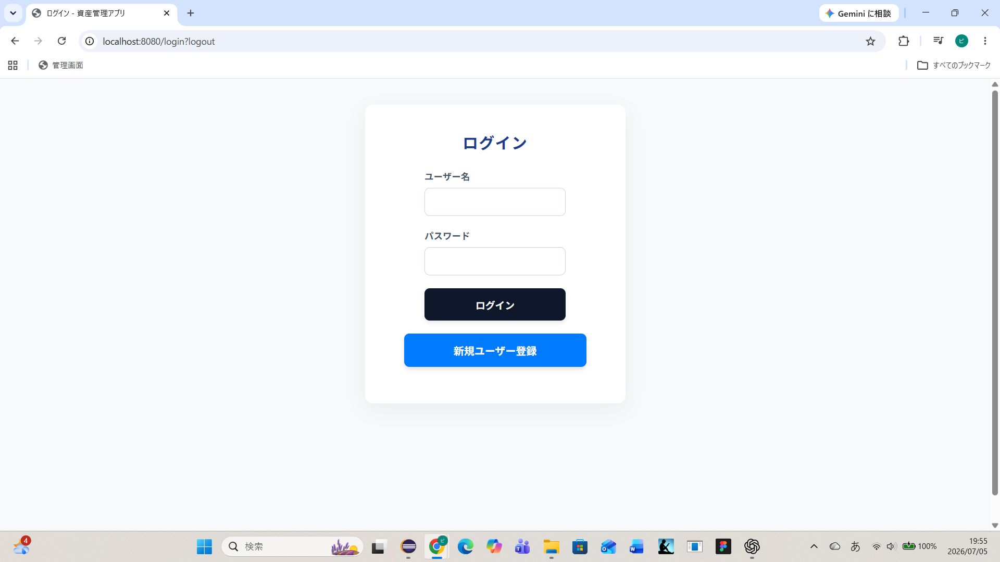
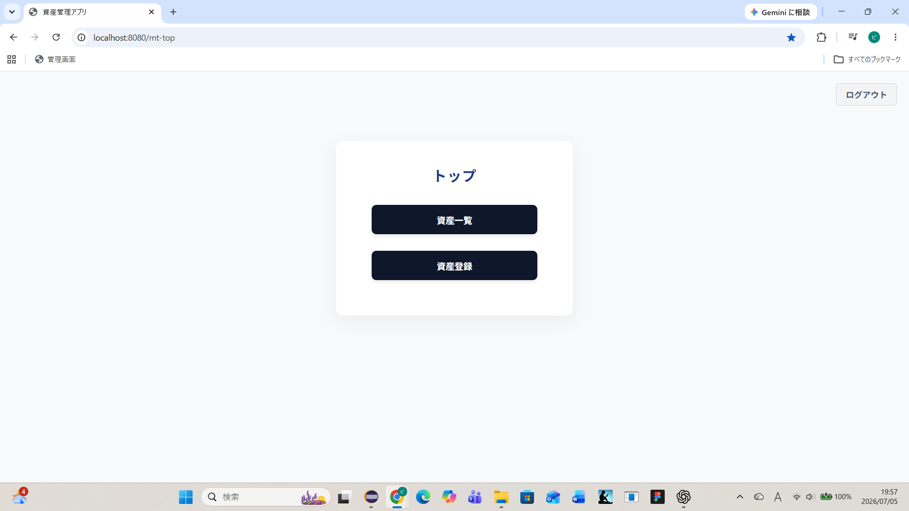
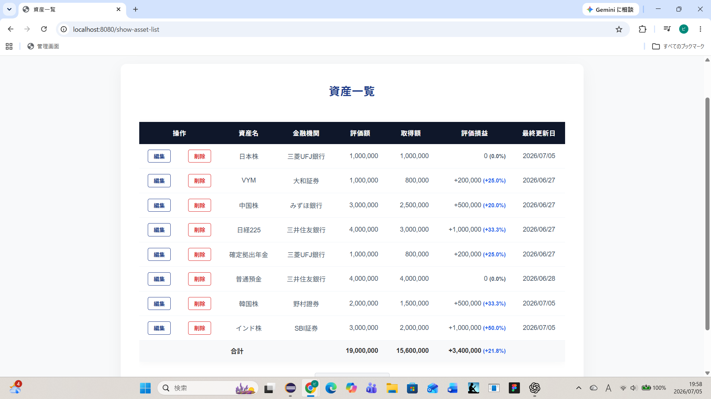
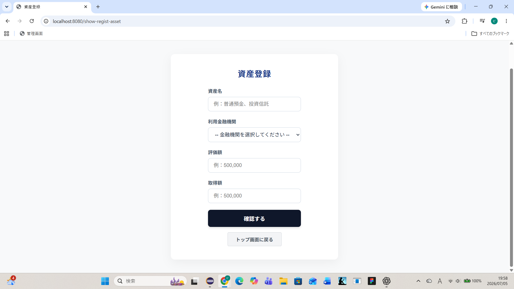
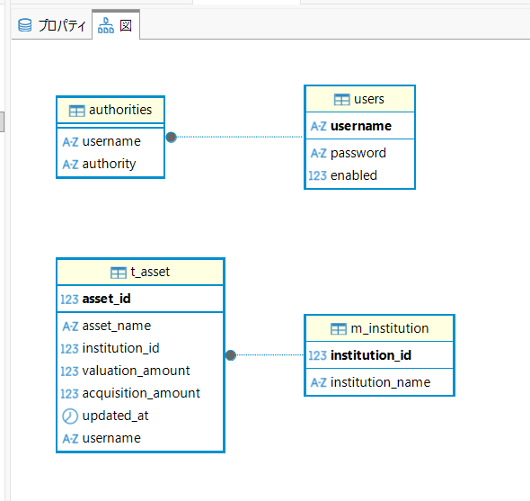

# 資産管理アプリ

## 概要

Spring Bootを用いて開発した資産管理アプリです。

預金や投資信託などの資産情報を登録し、
現在の評価額や取得額、評価損益を管理できます。

Java・Spring BootによるWebアプリケーション開発の学習成果として作成しました。

---

## 使用技術

| 項目 | 内容 |
|------|------|
| 言語 | Java 21 |
| フレームワーク | Spring Boot |
| 認証 | Spring Security |
| テンプレートエンジン | Thymeleaf |
| DBアクセス | Spring JDBC（JdbcTemplate） |
| データベース | MySQL |
| ビルドツール | Maven |
| 開発環境 | Eclipse |
| バージョン管理 | Git / GitHub |

---

## 主な機能

- ログイン・ログアウト
- 新規ユーザー登録
- 資産一覧表示
- 資産登録
- 資産編集
- 資産削除
- 評価損益・損益率の自動計算
- 入力値バリデーション
- エラーページ
- レスポンシブ対応

---

## 画面一覧

### ログイン




### トップ



### 資産一覧



### 資産登録




## データベース設計


### ER図




---

## 工夫した点

### Spring Securityによる認証

Spring Securityを利用し、
ログインしているユーザーのみが資産管理画面へアクセスできるようにしました。

### データベースアクセスについて

該当のユーザー以外の情報を操作・表示できないよう、SQL文に"WHERE username =  ?"を指定しています。
usernameはフォームで渡さず、各ServiceImplでSecurityContextから取得しています。

---

### 評価損益・損益率の自動計算

登録した評価額・取得額から評価損益および損益率を自動計算するよう実装しました。SQLで評価額と取得額の差分を計算し、
評価損益として取得しています。
損益のパーセンテージについてはHTML上で計算をおこない、プラスの場合は青字で、マイナスの場合は赤字で表示することで現在の資産の変動状況が一目でわかるように工夫を施しました。

---

### 金額入力の改善

金額入力欄ではJavaScriptを利用し、
入力中に3桁区切りのカンマを自動表示するようにしました。

送信時はカンマを除去してサーバへ送信しています。

---

### レスポンシブ対応

スマートフォンやタブレットでも利用しやすいよう、
レスポンシブデザインを採用しました。

一覧画面は横スクロールに対応しています。

---

## 苦労した点

Spring Securityの認証処理の流れを理解することに苦労しました。特に、Spring Securityの認証処理の流れを理解することに苦労しました。

特に、JdbcUserDetailsManagerがデータベースからユーザー情報を取得し、
UserDetailsとして認証処理へ渡す仕組みを理解するまで時間がかかりました。

公式ドキュメントや書籍を参考にしながら認証の流れを学び、
ログイン機能を実装しました。公式ドキュメントや書籍を参考にしながら認証の仕組みを学び、ログイン機能を実装しました。

また、資産一覧テーブルのレスポンシブ対応ではレイアウトが崩れたため、
CSSを整理し、横スクロール対応へ変更しました。

---

## 今後改善したい点

- 検索機能
- ソート機能
- CSVインポート・エクスポート
- グラフによる資産推移表示
- ページネーション

---

## 実行方法

1. MySQLを起動
2. データベースを作成
3. application.propertiesを設定
4. Spring Bootを起動
5. ブラウザでアクセス

※application.propertiesにご自身のデータベース接続情報を設定してください。

```
http://localhost:8080/login
```

---

## 制作期間

約1か月

---

## 作者

小林駿平

GitHub
